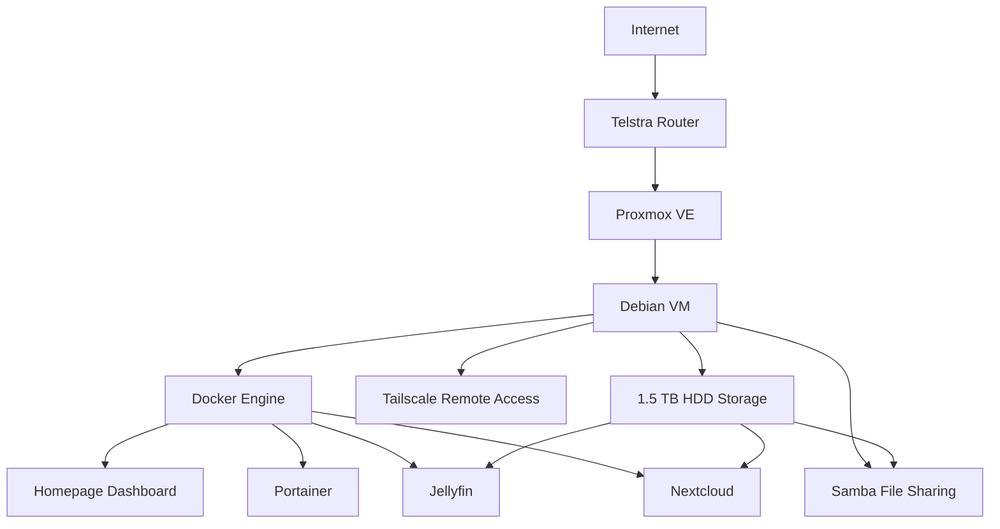

#  Home Lab

> A self-hosted infrastructure built with Proxmox, Linux and Docker for learning system administration, networking and cybersecurity.

---

##  About

This Home Lab is a personal infrastructure project built to gain practical experience in system administration, virtualization, containerization, networking and cybersecurity.

Instead of relying only on courses or certifications, I use this environment to deploy real services, solve real problems and document every step of the journey. Each service is planned, configured, tested and maintained as part of a continuously evolving infrastructure.

The goal is not simply to self-host applications, but to understand how modern IT environments are designed, managed and secured. Every deployment, configuration change, troubleshooting process and improvement is documented to build both technical knowledge and a professional portfolio.

This repository reflects the current state of my Home Lab and grows as new technologies, services and best practices are implemented.
---

##  Project Goals

This Home Lab was created with the following objectives:

Develop practical Linux system administration skills.
Build and manage a virtualized environment using Proxmox VE.
Deploy and maintain self-hosted applications with Docker and Docker Compose.
Improve networking knowledge through hands-on configuration and troubleshooting.
Learn infrastructure management by operating real services.
Practice documentation using professional standards.
Develop troubleshooting skills by solving real-world issues.
Explore cybersecurity concepts in a safe and controlled environment.
Build a technical portfolio that demonstrates practical experience rather than only theoretical knowledge.

---

##  Infrastructure Overview

The Home Lab is built around a dedicated HP EliteDesk 800 G3 running Proxmox VE as the virtualization platform. A Debian virtual machine hosts the Docker environment where the self-hosted services are deployed.

The infrastructure is designed to provide a practical environment for learning, experimentation and long-term operation while following good practices for organization, documentation and maintainability.

### Hardware

| Component | Details                      |
| --------- | ---------------------------- |
| Server    | HP EliteDesk 800 G3          |
| CPU       | Intel Core i5-6600           |
| Memory    | 16 GB DDR4 *(32 GB planned)* |
| Storage   | 256 GB NVMe SSD + 1.5 TB HDD |

### Virtualization

| Layer                | Technology |
| -------------------- | ---------- |
| Hypervisor           | Proxmox VE |
| Virtual Machine      | Debian     |
| Container Platform   | Docker     |
| Container Management | Portainer  |

## Architecture

##  Services

The Home Lab currently runs the following self-hosted services.

| Service    | Purpose                                                     | Status    |
| ---------- | ----------------------------------------------------------- | --------- |
| Proxmox VE | Virtualization platform hosting the Home Lab infrastructure |  Running |
| Debian VM  | Main operating system for containerized services            |  Running |
| Docker     | Container platform used to deploy applications              |  Running |
| Portainer  | Web interface for Docker container management               |  Running |
| Homepage   | Central dashboard providing quick access to all services    |  Running |
| Nextcloud  | Private cloud storage and file synchronization              |  Running |
| Jellyfin   | Self-hosted media server for personal content               |  Running |
| Samba      | Local network file sharing                                  |  Running |
| Tailscale  | Secure remote access to the Home Lab through a private VPN  |  Running |

##  Documentation

The complete documentation for this Home Lab is organized into dedicated sections, making it easy to navigate and maintain as the project grows.

| Section         | Description                                                 |
| --------------- | ----------------------------------------------------------- |
| Hardware        | Server specifications, storage and future upgrades          |
| Network         | Network topology, addressing and connectivity               |
| Virtualization  | Proxmox configuration and virtual machines                  |
| Containers      | Docker architecture, Compose files and container management |
| Services        | Documentation for each deployed service                     |
| Storage         | Mount points, file sharing and media organization           |
| Security        | Remote access, permissions and security practices           |
| Backup          | Backup strategy and recovery planning                       |
| Troubleshooting | Problems encountered and how they were resolved             |
| Roadmap         | Planned improvements and future services                    |

Each section contains detailed documentation, configuration notes and lessons learned throughout the project.

##  Roadmap

* [ ] Grafana
* [ ] Prometheus
* [ ] Immich
* [ ] Pi-hole
* [ ] Nginx Proxy Manager
* [ ] Wazuh

---

